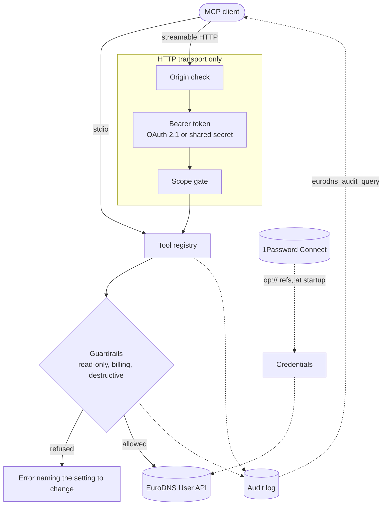

<div align="center">

# eurodns-mcp

**Manage your domains, DNS zones and subscriptions by asking for it.**

A [Model Context Protocol](https://modelcontextprotocol.io) server for the EuroDNS User API —
domains, DNS zones, contacts, subscriptions, SSL, invoices and orders.

[](https://github.com/JigSawFr/eurodns-mcp/actions/workflows/ci.yml)
[](LICENSE)
[](package.json)
[](https://modelcontextprotocol.io/specification/2025-11-25)

</div>

> This is an independent open-source project. It is **not affiliated with, endorsed by, or
> supported by EuroDNS**. "EuroDNS" is used only to identify the API this server talks to.

> Written by a professional engineer with AI assistance. Every line was reviewed before it
> was committed, and the responsibility for what it does is human.

---

## What you get

- **Full API coverage** — 79 tools generated from the OpenAPI document, grouped into 16 areas.
- **Three DNS workflow tools** that make record edits safe, because saving a zone replaces it.
- **Guardrails** so a deployment can refuse operations that spend money or destroy things.
- **Two transports** — `stdio` for a local client, streamable HTTP for a shared deployment.
- **OAuth 2.1 or a shared token** on HTTP, with an audit line per call.
- **Queryable history** — ask the server what has been done, and by whom.
- **1Password Connect** as an optional source for any secret it reads.

## How it works



Two things are worth reading off that diagram. Authorisation has **two independent gates** —
what the deployment permits at all, then what the caller's scopes permit within it. And the
audit log is fed by **every** path, including refusals, because the upstream API
authenticates every caller with one shared key and cannot attribute anything itself.

## Requirements

- Node.js 20 or newer.
- EuroDNS API credentials: an **Application ID** and an **API key**, created in the EuroDNS
  dashboard under API access.
- **The public IP of the machine running this server must be allowlisted** in the same
  dashboard. A `403` from the API is almost always a missing allowlist entry, not bad
  credentials.

## Quick start

The package is not on npm yet, so it installs from this repository. For a client that spawns
the server itself, such as Claude Desktop:

```json
{
  "mcpServers": {
    "eurodns": {
      "command": "npx",
      "args": ["-y", "github:JigSawFr/eurodns-mcp"],
      "env": {
        "EURODNS_APP_ID": "your-application-id",
        "EURODNS_API_KEY": "your-api-key"
      }
    }
  }
}
```

To try it in a terminal first:

```bash
npx -y github:JigSawFr/eurodns-mcp
```

For a shared deployment over HTTP, use the container instead — see
[Deployment](#deployment).

## What you can ask it

| Ask                                                   | Tool it reaches for                   |
| ----------------------------------------------------- | ------------------------------------- |
| "What DNS records does example.com have?"             | `eurodns_dns_get_zone`                |
| "Add a TXT record `_acme-challenge` on example.com"   | `eurodns_dns_upsert_record`           |
| "What would change if I pointed www at 203.0.113.10?" | `eurodns_dns_diff_zone`               |
| "Is example.lu available?"                            | `eurodns_domain_check_availability`   |
| "Which of my domains have DNSSEC enabled?"            | `eurodns_domain_search`               |
| "When does this SSL certificate expire?"              | `eurodns_ssl_list_subscriptions`      |
| "What is my prepaid balance?"                         | `eurodns_account_get_prepaid_balance` |
| "What did I change last week?"                        | `eurodns_audit_query`                 |
| "What was refused, and why?"                          | `eurodns_audit_query`                 |

## Tools

79 tools are generated from the OpenAPI document, plus three hand-written DNS workflow tools
and, when enabled, the history query.

| Area                 | Tools | Covers                                                      |
| -------------------- | ----: | ----------------------------------------------------------- |
| `dns`                |    16 | Zones, records, zone profiles, snapshots, DNSSEC signing    |
| `ssl`                |    13 | Subscriptions, certificates, validation, reissue, revoke    |
| `email`              |     8 | Mailbox subscriptions, aliases, catch-all, passwords        |
| `premium_dns`        |     8 | Premium DNS subscriptions and their lifecycle               |
| `contact`            |     6 | Reusable contact profiles and their default states          |
| `domain`             |     5 | Domain lookup, search, availability, DNSSEC at the registry |
| `nameserver`         |     5 | Reusable nameserver profiles                                |
| `https_redirect`     |     4 | HTTPS redirect subscriptions                                |
| `tld`                |     2 | TLD terms and requirements                                  |
| `invoice`            |     2 | Invoice lookup and search                                   |
| `invoice_profile`    |     2 | Customer invoice profiles                                   |
| `order`              |     2 | Orders and per-line delivery status                         |
| `subscription`       |     2 | Cross-product search, auto-renewal settings                 |
| `microsoft`          |     2 | Microsoft subscriptions                                     |
| `account`            |     1 | Prepaid balance                                             |
| `contact_validation` |     1 | Resending contact validation email                          |

Every tool name is prefixed with `eurodns_` so it cannot collide with another server's, and
carries `readOnlyHint`, `destructiveHint` and `idempotentHint` annotations derived from what
the operation actually does.

## The DNS workflow tools

`PUT /dns-zones/{domain}` replaces the **entire** zone document: a caller that sends a
partial zone silently deletes everything it left out. Three tools exist so that never
happens by accident.

| Tool                        | What it does                                                                                                 |
| --------------------------- | ------------------------------------------------------------------------------------------------------------ |
| `eurodns_dns_diff_zone`     | Reports what a proposed record set would change. Writes nothing.                                             |
| `eurodns_dns_upsert_record` | Reads the zone, applies one change, validates it with the API, and saves only if validation passes.          |
| `eurodns_dns_delete_record` | Resolves a record's id from its type and host, then deletes it. Refuses to guess when several records match. |

The raw generated tools (`eurodns_dns_save_zone`, `eurodns_dns_add_records`,
`eurodns_dns_delete_record_by_id`) remain available for callers that know exactly what they
are doing.

Three details worth knowing, all of which this server enforces for you:

- The record value field is **`rdata`**, not `data`. Sending `data` fails with an opaque
  "unexpected technical error".
- TTL accepts only twelve values: 600, 900, 1800, 3600, 7200, 14400, 21600, 43200, 86400,
  172800, 432000, 604800.
- `MAIL` and `URL` are **not** record types. They are pseudo types for the zone's mail and
  URL forwards, which carry different fields. The record tools refuse them and say so.

## Guardrails

Every operation is classified by what it can cost you. Two gates apply, and both must pass.

**1. Deployment gates** — what this deployment permits at all:

| Variable                    | Default | Effect when unset                                                                                                    |
| --------------------------- | ------- | -------------------------------------------------------------------------------------------------------------------- |
| `EURODNS_READ_ONLY`         | `false` | —                                                                                                                    |
| `EURODNS_ALLOW_BILLING`     | `false` | The **11** operations that create a charge or extend a paid term are refused.                                        |
| `EURODNS_ALLOW_DESTRUCTIVE` | `false` | The **8** irreversible operations outside DNS (subscription deletions, SSL revocation and cancellation) are refused. |

Setting `EURODNS_READ_ONLY=true` means state-changing tools are not advertised at all.
A refusal always names the variable to set — nothing fails silently.

DNS record deletion stays available by default: a zone can be restored from a snapshot,
whereas a revoked certificate or a deleted subscription cannot.

**2. Scopes** — who, within that cap, may do it. Only in OAuth mode:

| Scope                 | Grants                                                 |
| --------------------- | ------------------------------------------------------ |
| `eurodns.read`        | The 36 read operations                                 |
| `eurodns.dns.write`   | DNS writes (zones, records, profiles)                  |
| `eurodns.destructive` | Deletions outside DNS, SSL revocation and cancellation |
| `eurodns.billing`     | The 11 operations that cost money                      |
| `eurodns.audit`       | Reading the action history                             |

Keeping both gates means enabling OAuth never silently widens what the server can do, and an
operator can shut off a whole class without touching the identity provider.

## Secrets

### Keeping the key out of the client config file

A client config such as `claude_desktop_config.json` stores the values in **clear text** in
your user profile. To avoid it, point the client at a wrapper that reads the key from your OS
keychain at launch:

```bash
#!/usr/bin/env bash
# eurodns-mcp-wrapper — chmod +x, then use it as "command" in the client config.
set -euo pipefail

# macOS
export EURODNS_APP_ID="$(security find-generic-password -s eurodns-app-id -w)"
export EURODNS_API_KEY="$(security find-generic-password -s eurodns-api-key -w)"

# Linux (libsecret):
#   export EURODNS_API_KEY="$(secret-tool lookup service eurodns key api)"
# Windows (PowerShell, with the SecretManagement module):
#   $env:EURODNS_API_KEY = Get-Secret -Name eurodns-api-key -AsPlainText

exec npx -y github:JigSawFr/eurodns-mcp
```

Store the secrets once with, for example,
`security add-generic-password -s eurodns-api-key -a "$USER" -w`.

### Reading secrets from 1Password Connect

If you already run a [1Password Connect](https://developer.1password.com/docs/connect) server,
any `EURODNS_*` variable may hold a secret reference instead of a value:

```bash
export OP_CONNECT_HOST="https://op-connect.internal:8080"
export OP_CONNECT_TOKEN="…"

export EURODNS_APP_ID="op://Infra/EuroDNS API/username"
export EURODNS_API_KEY="op://Infra/EuroDNS API/credential"
```

Both `op://vault/item/field` and `op://vault/item/section/field` work, and a segment that is
already a 1Password id is used as-is. This covers every secret the server reads, including
`EURODNS_MCP_TOKEN` and the OAuth settings.

This adds no dependency: the server calls the Connect REST API directly, and an environment
with no references never contacts 1Password at all. If a reference cannot be resolved the
server refuses to start, naming the reference and the step that failed — a server running
without its credentials would serve nothing and hide the cause.

References are resolved **once, at startup**. A value rotated in 1Password is picked up on
the next restart.

## HTTP transport

```bash
EURODNS_MCP_AUTH=token EURODNS_MCP_TOKEN="$(openssl rand -hex 32)" \
  docker run --rm -p 3000:3000 \
    -e EURODNS_APP_ID -e EURODNS_API_KEY \
    -e EURODNS_MCP_AUTH -e EURODNS_MCP_TOKEN \
    ghcr.io/jigsawfr/eurodns-mcp:latest
```

The endpoint is `POST /mcp`; `GET /healthz` reports readiness without authentication.
Sessions are not used, so any number of instances can sit behind a load balancer.

The server **refuses to start on a non-loopback address without authentication**. Set
`EURODNS_ALLOWED_ORIGINS` when browser-based clients need to reach it — requests carrying
an `Origin` header that is not listed are rejected, which is what stops a DNS-rebinding
attack against a loopback deployment.

### OAuth 2.1

The server is an OAuth **resource server**. It does not issue tokens and embeds no identity
provider: point it at any authorization server that publishes RFC 8414 or OpenID Connect
discovery metadata.

```bash
EURODNS_MCP_AUTH=oauth \
EURODNS_OAUTH_ISSUER=https://issuer.example.com \
EURODNS_MCP_PUBLIC_URL=https://mcp.example.com/mcp \
  docker run --rm -p 3000:3000 -e EURODNS_MCP_AUTH -e EURODNS_OAUTH_ISSUER \
    -e EURODNS_MCP_PUBLIC_URL -e EURODNS_APP_ID -e EURODNS_API_KEY \
    ghcr.io/jigsawfr/eurodns-mcp:latest
```

At the authorization server, register this server as an API whose identifier is exactly
`EURODNS_MCP_PUBLIC_URL`, expose the scopes above, and let your MCP client request them.
Names differ by product — an _API/Application ID URI_ in Microsoft Entra ID, an _audience_ in
Auth0, a _client scope_ on a Keycloak client — but the shape is the same everywhere.

A pre-registered `client_id` is fine, and is what the specification prefers: dynamic client
registration (RFC 7591) is deprecated in favour of Client ID Metadata Documents, so an
authorization server that does not implement RFC 7591 is not a problem.

What the server does with a token:

- Validates the signature against the discovered JWKS, plus `iss`, `exp` and `nbf`.
- **Validates `aud` against its own identifier.** Without this, a token minted for any other
  resource behind the same authorization server would be accepted here.
- Never forwards the token upstream. The EuroDNS API is called with the server's own
  credentials, as the specification requires.
- Answers a missing scope with `403` and
  `WWW-Authenticate: Bearer error="insufficient_scope", scope="…"`, so a client can request
  consent for exactly what is missing rather than failing outright.

## Audit log

One JSON line per tool call, on stderr by default:

```json
{
  "ts": "2026-01-01T10:00:00.000Z",
  "correlationId": "…",
  "actor": { "mode": "oauth", "subject": "alice@example.com" },
  "tool": "eurodns_dns_upsert_record",
  "risk": "write",
  "target": "example.com",
  "verdict": "allowed",
  "upstreamStatus": 204,
  "durationMs": 412
}
```

The upstream API sees a single shared key for every caller, so this log is the only place an
action can be traced to a person.

- **Refusals are logged too**, with their reason — usually the most interesting line.
- State-changing calls write a `started` line **before** the upstream request, so a crash
  mid-write still leaves a trace of what was attempted.
- Arguments are reduced to scalars and long strings become a length marker. Request bodies
  and record values are never written: a TXT value is often a short-lived secret.

Set `EURODNS_AUDIT_DESTINATION` to `stderr` (default), `stdout`, `file` (with
`EURODNS_AUDIT_FILE`) or `none`. `stdout` is refused under stdio, where it carries the
JSON-RPC stream.

### Asking the server what happened

With `EURODNS_AUDIT_QUERY` set, a `eurodns_audit_query` tool answers questions about past
actions — which tool ran, on what, for whom, and whether it was allowed, refused or failed.
Filter by time range, tool, target, verdict or risk class.

| Value           | Effect                                |
| --------------- | ------------------------------------- |
| `off` (default) | No query tool.                        |
| `own`           | A caller sees only their own actions. |
| `all`           | A caller sees every action.           |

Three things are deliberate here. It requires `EURODNS_AUDIT_DESTINATION=file` — stderr and
stdout are write-only, so there would be nothing to read back. It needs its own
**`eurodns.audit`** scope rather than riding on `eurodns.read`, because reading who did what
is not reading DNS data. And in `own` mode an explicit `actor` filter is refused rather than
quietly ignored, so nobody mistakes a filtered result for the whole picture.

Queries read a bounded window from the end of the log. When older entries lie beyond it the
result says so, so you narrow the time range instead of concluding you have seen everything.

## Configuration reference

<details>
<summary>All environment variables</summary>

| Variable                      | Default                        | Purpose                                                  |
| ----------------------------- | ------------------------------ | -------------------------------------------------------- |
| `EURODNS_APP_ID`              | —                              | **Required.** Application ID.                            |
| `EURODNS_API_KEY`             | —                              | **Required.** API key.                                   |
| `EURODNS_BASE_URL`            | `https://rest-api.eurodns.com` | API base URL.                                            |
| `EURODNS_TIMEOUT_MS`          | `30000`                        | Upstream request timeout.                                |
| `EURODNS_MAX_RETRIES`         | `2`                            | Retries, for 429 and 5xx only.                           |
| `EURODNS_CHARACTER_LIMIT`     | `25000`                        | Response size before truncation.                         |
| `EURODNS_READ_ONLY`           | `false`                        | Advertise read tools only.                               |
| `EURODNS_ALLOW_BILLING`       | `false`                        | Permit operations that cost money.                       |
| `EURODNS_ALLOW_DESTRUCTIVE`   | `false`                        | Permit irreversible non-DNS operations.                  |
| `EURODNS_AUDIT_DESTINATION`   | `stderr`                       | `stderr`, `stdout`, `file`, `none`.                      |
| `EURODNS_AUDIT_FILE`          | —                              | Required when the destination is `file`.                 |
| `EURODNS_AUDIT_QUERY`         | `off`                          | `off`, `own` or `all`. Requires the `file` destination.  |
| `EURODNS_AUDIT_MAX_BYTES`     | `67108864`                     | Size at which the log rotates to `<file>.1`.             |
| `OP_CONNECT_HOST`             | —                              | 1Password Connect server, when using `op://` references. |
| `OP_CONNECT_TOKEN`            | —                              | Connect token for that server.                           |
| `HOST`                        | `127.0.0.1`                    | HTTP bind address.                                       |
| `PORT`                        | `3000`                         | HTTP port.                                               |
| `EURODNS_MCP_AUTH`            | `none`                         | `oauth`, `token` or `none`.                              |
| `EURODNS_MCP_TOKEN`           | —                              | Shared secret, at least 32 characters.                   |
| `EURODNS_MCP_TOKEN_LABEL`     | `static-token`                 | Name recorded in the audit log for that token.           |
| `EURODNS_MCP_PUBLIC_URL`      | —                              | Canonical public URL; also the default OAuth audience.   |
| `EURODNS_ALLOWED_ORIGINS`     | —                              | Comma-separated origins allowed to call the server.      |
| `EURODNS_MAX_BODY_BYTES`      | `1048576`                      | Largest JSON body accepted, checked before auth.         |
| `EURODNS_OAUTH_ISSUER`        | —                              | Authorization server issuer.                             |
| `EURODNS_OAUTH_AUDIENCE`      | `EURODNS_MCP_PUBLIC_URL`       | Expected `aud` claim.                                    |
| `EURODNS_OAUTH_JWKS_URI`      | discovered                     | Overrides JWKS discovery.                                |
| `EURODNS_OAUTH_SUBJECT_CLAIM` | `sub`                          | Claim recorded as the actor.                             |
| `EURODNS_OAUTH_SCOPE_CLAIM`   | `scope`, `scp`, `roles`        | Claim carrying scopes.                                   |
| `EURODNS_OAUTH_ALGORITHMS`    | asymmetric set                 | Signature algorithms accepted. Never includes `HS*`.     |

</details>

## Deployment

```bash
cp .env.example .env    # credentials, plus a token: openssl rand -hex 32
docker compose up -d
curl localhost:3000/healthz
```

Published images live at `ghcr.io/jigsawfr/eurodns-mcp`, built for `linux/amd64` and
`linux/arm64` with a build provenance attestation.

Two things decide where this runs, and neither is the usual latency-or-price argument:

- **The EuroDNS API filters by source IP**, so the host has to give you a stable — ideally
  dedicated — egress address. An IP shared with other tenants keeps the mechanism and loses
  the protection.
- **The history query tool reads a file**, so the host needs a persistent disk. That rules
  out platforms with an ephemeral filesystem.

On both counts Fly.io comes out ahead, at a couple of dollars a month for a dedicated IPv4
against roughly $100 elsewhere. [`deploy/`](deploy/README.md) has the per-platform detail,
ready-made `fly.toml` and `render.yaml`, and the comparison in full.

One setting catches everyone once: inside a container the server listens on `0.0.0.0`, and
it **refuses to start on a non-loopback address without authentication**. Set
`EURODNS_MCP_AUTH` to `token` or `oauth`.

## Development

```bash
npm install
npm run gen      # regenerate src/generated from spec/openapi.json
npm run build
npm test
npx @modelcontextprotocol/inspector node dist/index.js
```

The tool surface is generated from `spec/openapi.json`; CI regenerates it and fails if the
committed output has drifted. Edit the generator or the curated names and descriptions in
`src/tools/`, never `src/generated/`.

Tests run against a real MCP client over an in-memory transport, with the HTTP layer driven
through the real Express app. No test touches the network.

### Releasing

Releases are cut by [release-please](https://github.com/googleapis/release-please) from
[Conventional Commit](https://www.conventionalcommits.org) subjects. It keeps a release pull
request open, accumulating `CHANGELOG.md`; merging it tags the version, publishes a GitHub
Release, and that Release triggers the image build.

Only the **subject line** follows the convention — commit bodies stay prose. `feat:` bumps
the minor, `fix:` the patch, and a `!` or `BREAKING CHANGE:` bumps the minor too while the
project is pre-1.0.

Squash merges are the most predictable setup, since the pull request title then becomes the
commit subject — which is why CI checks that title. The failure mode this guards against is
quiet: a non-conforming subject contributes nothing and no release appears.

The version stays in `0.x` until the server has been exercised against the real EuroDNS API.

## Protocol version

Built on MCP `2025-11-25`, the revision the TypeScript SDK implements. Revision `2026-07-28`
removes sessions and the initialization handshake; this server is already stateless, and the
authorization design it relies on is unchanged in that revision, so adopting it will be an
SDK upgrade rather than a rewrite.

## License

[MIT](LICENSE).
